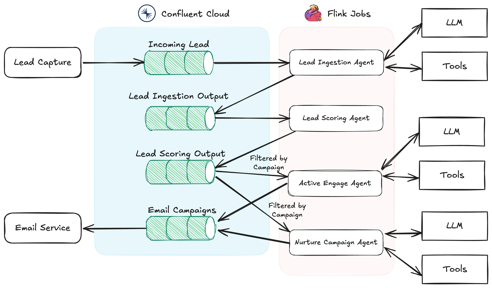

# Multi-Agent AI SDR for Lead Processing
This application uses Apache Flink, Apache Kafka, and OpenAI to create an AI-based SDR.

The multi-agent system automates the SDR workflow by orchestrating a series of AI agents, each responsible for a specific task in the lead management and outreach process.

The system is event-driven, leveraging [Confluent Cloud's](https://www.confluent.io/) as the backbone for real-time communication and data flow between agents. Each agent is a microservice that runs as a Flink job.

At a high level, the initial system consists of the following key agents:

* Lead Ingestion Agent: Captures incoming leads and enriches them with external data (e.g., company website, Salesforce), and generates a research report that can be used for scoring
* Lead Scoring Agent: Uses the enriched lead information to score the lead and generate a short summary for how to best engage the lead. Determines the appropriate next step based on lead quality, either triggering the nurture agent sequence designer or triggering an active outreach campaign.
* Active Outreach Agent: Creates personalized outreach emails using AI-driven content generation, incorporating insights from the lead’s online presence, trying to book a meeting
* Nurture Campaign Agent: Dynamically creates a sequence of emails based on where the lead originated and what their interest was.

Each agent is designed to run as a Flink job with a brain that communicates via event streams in Confluent Cloud, allowing for real-time processing and asynchronous handoffs between agents. The tools used by the agents all generate fake data for testing purposes via an OpenAI API call.

The diagram below illustrates how these agents interact through event-driven messaging.

<p align="center">
  
</p>

## How it works
As a user, you can enter a lead the `incoming_leads` Kafak topic. This starts the multi-agent process. In a real application, a form or CRM would populate the 
`incoming_leads` topic.

# What you'll need
In order to set up and run the application, you need the following:

* [Java 21](https://www.oracle.com/java/technologies/downloads/)
* [Flink v2.1](https://nightlies.apache.org/flink/flink-docs-master/)
* A [Confluent Cloud](https://www.confluent.io/) account
* An [OpenAI](https://openai.com/) API key

## Getting set up

### Get the starter code
In a terminal, clone the sample code to your project's working directory with the following command:

```shell
git clone https://github.com/thefalc/open-source-flink-ai-agent-experiments.git
```

### Setting up Apache Flink

* Downloads and install [Flink v2.1](https://nightlies.apache.org/flink/flink-docs-master/)
* Update /flink/conf/conf.yaml setting `taskmanager.numberOfTaskSlots: 4`
* Start the Flink cluster `/flink/bin/start-cluster.sh`

### Configure the AI SDR application

Go into your `multi-agent-sdr` folder and create a `.env` file with your OpenAI API key.

```bash
OPENAI_API_KEY=REPLACE_ME
```

Next, following the [instructions](https://docs.confluent.io/cloud/current/client-apps/config-client.html) to create a new Java client. Once the client downloads, unzip it and find the `client.properties` file. Copy this as `consumer.properties` and `producer.properties` into the /open-source-flink-ai-agent-experiments/multi-agent-sdr/src/main/resources folder.

### Setting up Confluent Cloud

The AI SDR uses Confluent Cloud to move data in real-time for communication between the agents.

#### Create the topics for agent communication and routing

In your Confluent Cloud account.

* Go to your Kafka cluster and click on **Topics** in the sidebar.
* Name the topic as `incoming_leads`.
* Set other configurations as needed, such as the number of partitions and replication factor, based on your requirements.
* Go to **Schema Registry**
* Click **Add Schema** and select **incoming_leads** as the subject
* Choose JSON Schema as the schema type
* Paste the schema from below into the editor

```json
{
  "properties": {
    "lead_data": {
      "connect.index": 0,
      "oneOf": [
        {
          "type": "null"
        },
        {
          "properties": {
            "company_name": {
              "type": "string"
            },
            "company_website": {
              "format": "uri",
              "type": "string"
            },
            "email": {
              "format": "email",
              "type": "string"
            },
            "job_title": {
              "type": "string"
            },
            "lead_source": {
              "type": "string"
            },
            "name": {
              "type": "string"
            },
            "project_description": {
              "type": "string"
            }
          },
          "required": [
            "name",
            "email",
            "company_name",
            "lead_source",
            "job_title"
          ],
          "type": "object"
        }
      ]
    }
  },
  "title": "Record",
  "type": "object"
}
```

* Save the schema

Next, we are going to create a topic for the LeadIngestionAgentJob to write to.

* Go to your Kafka cluster and click on **Topics** in the sidebar.
* Name the topic as `lead_ingestion_output`.
* Set other configurations as needed, such as the number of partitions and replication factor, based on your requirements.
* Go to **Schema Registry**
* Click **Add Schema** and select **lead_ingestion_output** as the subject
* Choose JSON Schema as the schema type
* Paste the schema from below into the editor

```json
{
  "properties": {
    "context": {
      "connect.index": 1,
      "oneOf": [
        {
          "type": "null"
        },
        {
          "type": "string"
        }
      ]
    },
    "lead_data": {
      "connect.index": 0,
      "oneOf": [
        {
          "type": "null"
        },
        {
          "properties": {
            "company_name": {
              "type": "string"
            },
            "company_website": {
              "format": "uri",
              "type": "string"
            },
            "email": {
              "format": "email",
              "type": "string"
            },
            "job_title": {
              "type": "string"
            },
            "lead_source": {
              "type": "string"
            },
            "name": {
              "type": "string"
            },
            "project_description": {
              "type": "string"
            }
          },
          "required": [
            "name",
            "email",
            "company_name",
            "lead_source",
            "job_title"
          ],
          "type": "object"
        }
      ]
    }
  },
  "title": "Record",
  "type": "object"
}
```

Next, we are going to create a topic for the LeadScoringAgentJob to write to.

* Go to your Kafka cluster and click on **Topics** in the sidebar.
* Name the topic as `lead_scoring_output`.
* Set other configurations as needed, such as the number of partitions and replication factor, based on your requirements.
* Go to **Schema Registry**
* Click **Add Schema** and select **lead_scoring_output** as the subject
* Choose JSON Schema as the schema type
* Paste the schema from below into the editor

```json
{
  "properties": {
    "lead_data": {
      "connect.index": 0,
      "oneOf": [
        {
          "type": "null"
        },
        {
          "properties": {
            "company_name": {
              "type": "string"
            },
            "company_website": {
              "format": "uri",
              "type": "string"
            },
            "email": {
              "format": "email",
              "type": "string"
            },
            "job_title": {
              "type": "string"
            },
            "lead_source": {
              "type": "string"
            },
            "name": {
              "type": "string"
            },
            "project_description": {
              "type": "string"
            }
          },
          "required": [
            "name",
            "email",
            "company_name",
            "lead_source",
            "job_title"
          ],
          "type": "object"
        }
      ]
    },
    "lead_evaluation": {
      "connect.index": 1,
      "properties": {
        "next_step": {
          "description": "Recommended next action based on lead score.",
          "enum": [
            "Actively Engage",
            "Nurture",
            "Disqualify"
          ],
          "type": "string"
        },
        "score": {
          "description": "Evaluation score of the lead (0-100).",
          "type": "string"
        },
        "talking_points": {
          "description": "Key discussion points for engaging the lead.",
          "items": {
            "type": "string"
          },
          "type": "array"
        }
      },
      "required": [
        "score",
        "next_step",
        "talking_points"
      ],
      "type": "object"
    }
  },
  "title": "Record",
  "type": "object"
}
```

* Save the schema

Finally, we are going to create a topic to write the email campaigns to.

* Go to your Kafka cluster and click on **Topics** in the sidebar.
* Name the topic as `email_campaigns`.
* Set other configurations as needed, such as the number of partitions and replication factor, based on your requirements.
* Go to **Schema Registry**
* Click **Add Schema** and select **email_campaigns** as the subject
* Choose JSON Schema as the schema type
* Paste the schema from below into the editor

```json
{
  "$schema": "https://json-schema.org/draft/2020-12/schema",
  "properties": {
    "campaign_type": {
      "description": "Defines the type of campaign: 'Nurture' for long-term relationship-building or 'Actively Engage' for immediate sales conversion.",
      "enum": [
        "Nurture",
        "Actively Engage"
      ],
      "type": "string"
    },
    "emails": {
      "items": {
        "properties": {
          "body": {
            "description": "Email content",
            "type": "string"
          },
          "subject": {
            "description": "Email subject line",
            "type": "string"
          },
          "to": {
            "description": "Recipient email address",
            "format": "email",
            "type": "string"
          }
        },
        "required": [
          "to",
          "subject",
          "body"
        ],
        "type": "object"
      },
      "type": "array"
    }
  },
  "title": "EmailCampaign",
  "type": "object"
}
```

* Save the schema

### Run the application

1. In a terminal, navigate to your project directory. Run the app with the following command:
```shell
mvn clean package
flink run -c agents.LeadIngestionAgentJob  target/ai-sdr-0.1.jar
flink run -c agents.LeadScoringAgentJob  target/ai-sdr-0.1.jar
flink run -c agents.ActiveOutreachAgentJob  target/ai-sdr-0.1.jar
flink run -c agents.NurtureCampaignAgentJob  target/ai-sdr-0.1.jar
```
2. In Confluent Cloud, navigate to the `incoming_leads` topic.
3. Click **Actions > Produce new message**
4. Paste the following into the **Value** field.
```json
{
  "lead_data": {
    "project_description": "111 Looking for a scalable data warehouse solution to support real-time analytics and AI-driven insights. Currently using Snowflake but exploring alternatives that better integrate with streaming data.",
    "company_name": "Tiger Analytics",
    "company_website": "https://www.tigeranalytics.com/",
    "lead_source": "Webinar - AI for Real-Time Data",
    "name": "Jane Doe",
    "job_title": "Director of Data Engineering",
    "email": "jane.doe@acmeanalytics.com"
  }
}
```
5. Wait for the agent flow to complete. If everything goes well, after a few minutes you'll have an email campaign in the `email_campaigns` topic.